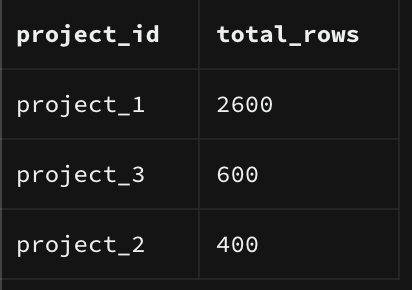

- updated npm
- set up project on local and opened with vscode
- created supabase project and made a table called tickets with 4 columns 
- filled rows with random data ranged over 6 months (3 projects, 1 with >1000 rows) using a seed file
    - seedfile format - YYYYMMDDHHMMSS_name.sql
    - LLM generated sql code with 3 errors 
        - table names were wrong, column names didnt match, union all_rows (wrong format)

- checking rows per project
SELECT 
project_id, 
COUNT(*) AS total_rows
FROM tickets
GROUP BY project_id
ORDER BY total_rows DESC;



- counting null counts for prediction_executed_at where project_id is project_1

SELECT COUNT(*) AS null_count
FROM tickets
WHERE project_id = 'project_1'
  AND prediction_executed_at IS NULL;

-creating a next api response page
    - making a page that responds random data
        - create pages/api/monthly-tickets-count.ts page
        - add template code : 
        
import type { NextApiRequest, NextApiResponse } from 'next';
export default function handler(req: NextApiRequest, res: NextApiResponse) {
  if (req.method === 'GET') {
    res.status(200).json([{ 
       "month" : "2026-01",
      count: 1 
    }]);
  } else {
    res.status(405).json({ message: "Method not allowed" });
  }
}


        - npm run dev 
        - check response on  http://localhost:3000/api/monthly-ticket-counts
         [{"month":"2026-01","count":1}]

- added req.query for specific project_id 
[{"month":"2026-01","count":1,"projectId":"project_1"}]

import type { NextApiRequest, NextApiResponse } from 'next';
// You must use a default export function for Pages router
export default function handler(req: NextApiRequest, res: NextApiResponse) {
  if (req.method === 'GET') {
    const { projectId } = req.query;
    res.status(200).json([{ 
      "month" : "2026-01",
      count: 1,
      projectId: projectId
    }]);
  } else {  
    res.status(405).json({ message: "Method not allowed" });
  }
}

-remove echo code and connect to supabase 
- use npm install @supabase/supabase-js to install the client 
- make env vars (get publishable/anon and API Url key from supabase)
- connnect to supabase and import env variables

import { createClient } from '@supabase/supabase-js';

const supabaseUrl = process.env.NEXT_PUBLIC_SUPABASE_URL;
const supabaseKey = process.env.NEXT_PUBLIC_SUPABASE_ANON_KEY;
if (!supabaseUrl || !supabaseKey) {
  throw new Error('Missing Supabase environment variables');
}

const supabase = createClient(supabaseUrl, supabaseKey);

- implement async/await 
  export default async function handler(req: NextApiRequest, res: NextApiResponse) {
    if (req.method === 'GET') {
      const { projectId: projectId } = req.query;
      if (typeof projectId !== 'string') {
        res.status(400).end('Invalid body: project_id is required and must be a string')
      return
      }

- query table from supabase

      const { data, error } = await supabase
      .from('tickets')
      .select('prediction_executed_at')
      .eq('project_id', projectId)
      .not('prediction_executed_at', 'is', null)

- error handling

if (error !== null) {
      console.error('😞 ', error)
      res.status(500).end(`${error.code} ${error.message}\n${error.details}`)
      return
    }

- enable rls policy on supabase for (select)
0 rows + no error + anon key ⇒ suspect RLS first.

- project 1 returns 1000 rows instead of 2340 (silent truncation) 
    - implement pagination to allow 1000+ rows

      const BATCH = 1000;
      let from = 0;
      let allRows: { prediction_executed_at: string }[] = [];

      while (true) {
        const { data, error } = await supabase
          .from('tickets')
          .select('prediction_executed_at')
          .eq('project_id', projectId)
          .not('prediction_executed_at', 'is', null)
          .range(from, from + BATCH - 1);   // rows from..to, INCLUSIVE, zero-based

        if (error) {
          res.status(500).json({ message: error.message });
          return;
        }
        allRows = allRows.concat(data);
        if (data.length < BATCH) break;  // short slice = last slice
        from += BATCH;
      }
      
- count rows per month 

      const tally: Record<string, number> = {};
      for (const row of allRows) {
        const month = row.prediction_executed_at.slice(0, 7);
        tally[month] = (tally[month] ?? 0) + 1;
} 
      console.log(tally)
  
- check for all projects per month

      const result = Object.entries(tally)                    
        .map(([name, n]) => ({ month: name, count: n }))
        .sort((a, b) => a.month.localeCompare(b.month));      

      res.status(200).json(result);
    } else {  
      res.status(405).json({ message: "Method not allowed" });
    }
  }

-app/ and pages/ collide
app/page.tsx (from create-next-app's default scaffold) claims the URL / — App Router
your new pages/index.tsx also claims / — Pages Router

Both routers may coexist in one project, but each URL must belong to exactly one of them. Two files claiming / → Next.js refuses to serve it: 

Conflicting app and pages file: "app/page.tsx" and "pages/index.tsx".

Checks

-Compare 6 numbers in browser vs supabase to confirm data correctness

Supabase
select
  left(prediction_executed_at::text, 7) as month,
  count(*) as count 
from tickets
where project_id = 'project_1'
  and prediction_executed_at is not null
group by 1
order by 1;

web

```
[{"month":"2026-01","count":394},{"month":"2026-02","count":391},{"month":"2026-03","count":389},{"month":"2026-04","count":389},{"month":"2026-05","count":389},{"month":"2026-06","count":388}]

supabase
| month   | count |
| ------- | ----- |
| 2026-01 | 394   |
| 2026-02 | 391   |
| 2026-03 | 389   |
| 2026-04 | 389   |
| 2026-05 | 389   |
| 2026-06 | 388   |
```

Data matches 

-UI page index.tsx

import { useState } from 'react';  
export default function Home() {
    const [projectId, setProjectId] = useState('project_1');
  
    return <div>

        <h1>Monthly Ticket Counts</h1>

        <label  htmlFor = "projectId">Choose a project:</label>

        <select name="tickets" id="projectId" value={projectId} onChange={(e) => setProjectId(e.target.value) }>
        <option value="project_1">Project_1</option>
        <option value="project_2">Project_2</option>
        <option value="project_3">Project_3</option>
        </select>

    <p>Selected: {projectId}</p>
    </div>
};

- loop rule
inside a loop or map, use the loop's own variable, never the outer collection.